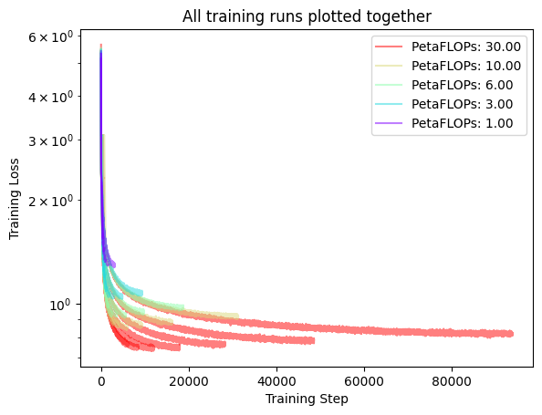
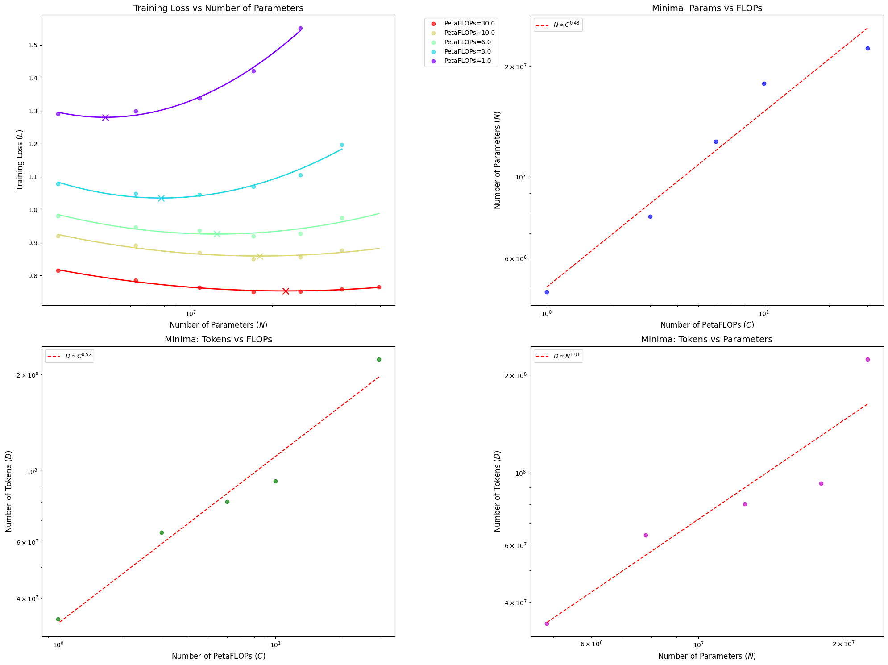

# Minchilla: A minima reproduction of the Chinchilla Scaling Laws

**Google Colab**: https://colab.research.google.com/drive/1NLta5gGVdZNq4N8vDG_l9_K8tVBDhrj6?authuser=1#scrollTo=jTkztyGtaev8

In this repo we apply method 2 (iso-flop curves) from the Chinchilla Scaling Laws Paper
(["Training Compute-Optimal Large Language Models" by Hoffmann et a.](https://arxiv.org/pdf/2203.15556))
to **very small transformers** on a **character-level lanugage modelling task**.

In this setting, we find a similar result that parameters and training tokens should be scaled up in
roughly equal proportions.

$$N_{opt} \propto C^{0.48}, \quad D_{opt} \propto C^{0.52}$$
where $D$ is the number of training tokens, $N$ is the number of model parameters, and $C$ is the number of FLOPs available for training.


## Environemnt setup

```bash
conda env create -f environment.yml
conda deactivate
conda activate minchilla
```

## Run trainings

Change `NUM_CUDA_DEVICES` and `MAX_CONCURRENT_PROCESSES` in `run_isoflops.py`.
Then run `python run_isoflops.py`

These trainings may take a while, depending on your machine. It took around 12 hours for us on 2 A5000's.
Alternatively, we have run these trainings and saved the outputs in `saved_outputs/`
(including full tensorboard logs).




## Estimate scaling laws

Run `plot_isoflops.py saved_outputs/`, which will produce the visualizations in `resources/`
If you saved the results somewhere else, you can do `plot_isoflops.py <your-output-dir>`.



From the above, we can see the scaling laws are roughly equal to those from Method 2 in the paper:

**Paper:**
$$N_{opt} \propto C^{0.49}, \quad D_{opt} \propto C^{0.51}$$

**Ours:**
$$N_{opt} \propto C^{0.48}, \quad D_{opt} \propto C^{0.52}$$


We note a few insights from this reproduction process:
1. **Outlier rejection is important:** some large models are not trained for a signifigant number of iterations, so they do not converge. This ruins the scaling laws. To get around this we: (1) Remove runs with a high final loss value, which indicates they did not converge, and (2) Use RANSAC when fitting the parabolas to remove the affect of outliers. To turn these off, set `REMOVE_OUTLIERS=False` and re-run the above code. This was not discussed in the original paper in the context of Method 2, presumably because they were working at a large enough scale and with tuned hyper-parameters that it was not an issue.
2. **Scaling laws are tricky with very small transformers:** Our original experiments included very small models (`<100K params`), but we couldn't see the scaling laws in that regime. The transformer width / depth ratios become skewed at those scales, which could have an effect. For example, all the models in these experiments had `n_layers = d_model // 64`, `n_heads = d_model // 64`, however for `d_model < 64` we can't use these simple rules.
3. We are doing **character level lanugage modelling** in this task, which is different from the token level language modelling in the original Chinchilla paper. This is mainly for practicle reasons; with characters the vocabluary is much smaller than tokens, so we can use much smaller models. Regardless, we recover a remarkably similar scaling law.
