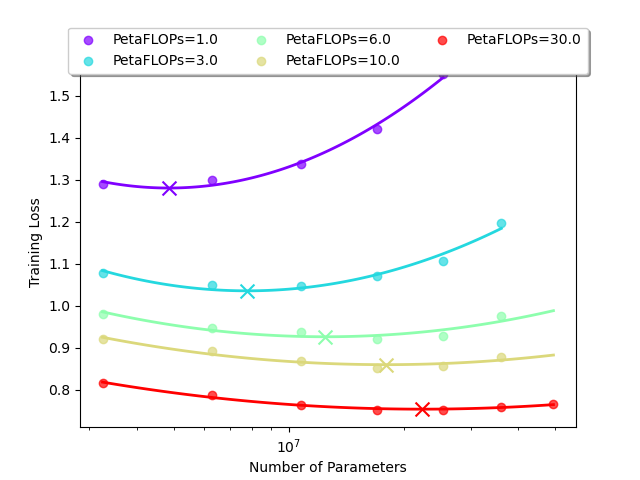
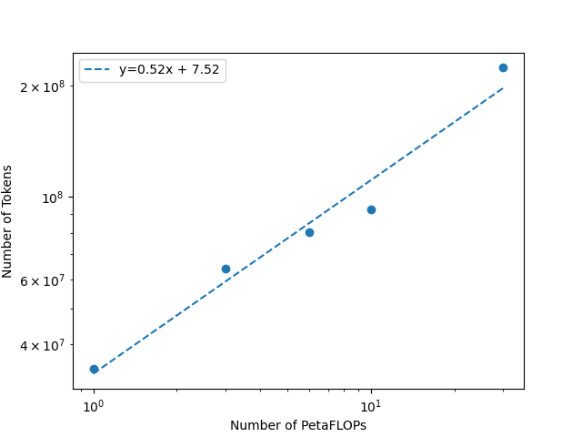
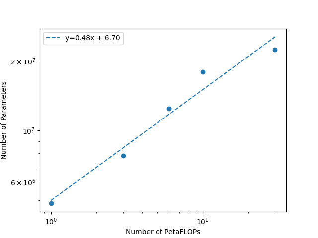
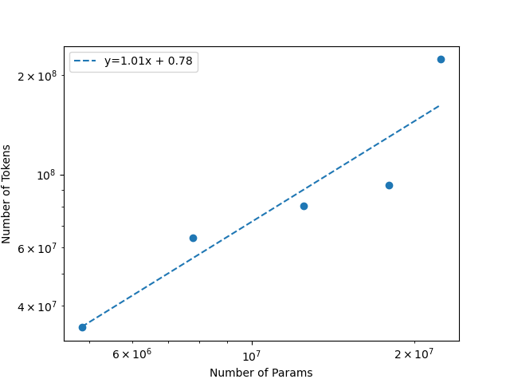

# Minchilla: A minima reproduction of the Chinchilla Scaling Laws

In this repo we apply method 2 (iso-flop curves) from the Chinchilla Scaling Laws Paper
(["Training Compute-Optimal Large Language Models" by Hoffmann et a.](https://arxiv.org/pdf/2203.15556))
to **very small transformers** on a **character-level lanugage modelling task**.

In this setting, we find a similar result that parameters and training tokens should be scaled up in
roughly equal proportions.

$$N_{opt} \propto C^{0.48}, \quad D_{opt} \propto C^{0.52}$$
where $D$ is the number of training tokens, $N$ is the number of model parameters, and $C$ is the number of FLOPs available for training.




## Environemnt setup

```bash
conda env create -f environment.yml
conda deactivate
conda activate minchilla
```

## Run trainings

Change `NUM_CUDA_DEVICES` and `MAX_CONCURRENT_PROCESSES` in `run_isoflops.py`.
Then run `python run_isoflops.py`

These trainings may take a while, depending on your machine. It took around 12 hours for us on 2 A5000's.
Alternatively, we have run these trainings and saved the outputs in `saved_outputs/`
(including full tensorboard logs).

## Estimate scaling laws

Run `plot_isoflops.py saved_outputs/`, which will produce the visualizations in `resources/`
If you saved the results somewhere else, you can do `plot_isoflops.py <your-output-dir>`.





